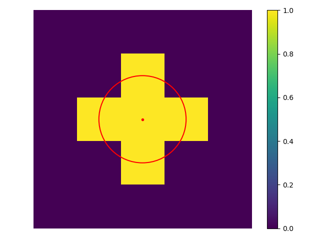
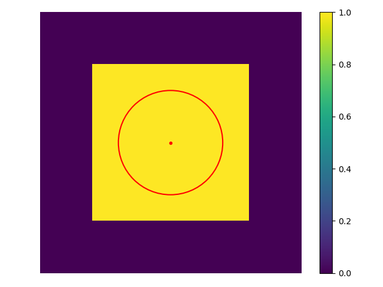
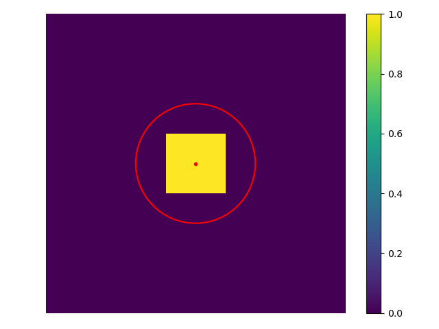
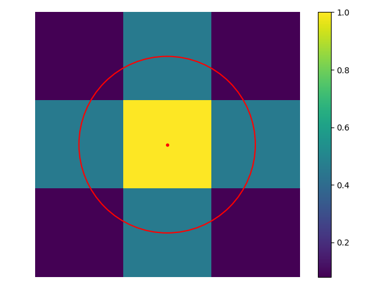
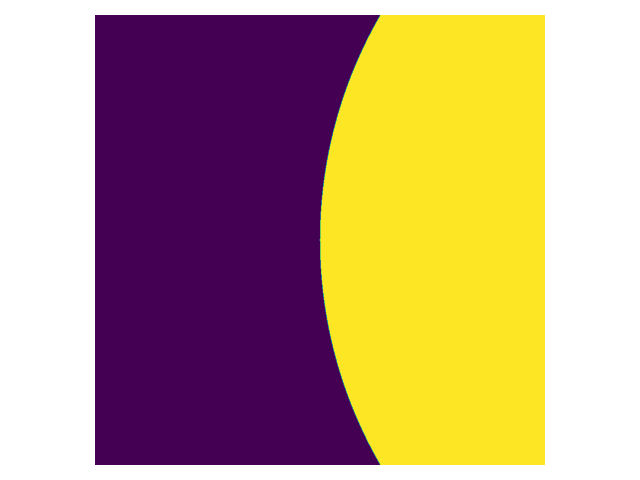
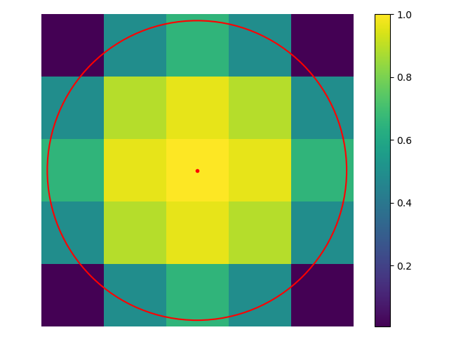
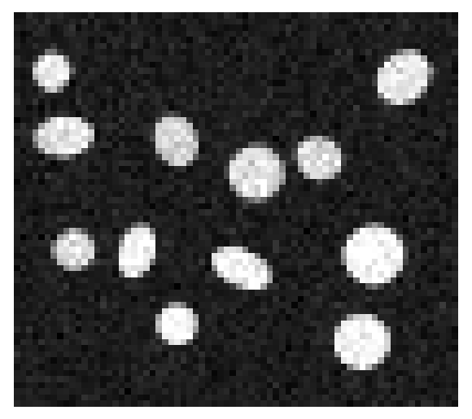

# 'fluoscenepy' Project

The 'fluoscenepy' project is designed to simulate microscopic images featuring basic structures such as beads and ellipses, 
calculated using various computational approaches.  
While this may sound ambitious, please consider it as an earnest attempt to provide a useful tool for diverse applications, such 
as evaluating image processing workflows, rather than a fully established or peer-reviewed solution. It is a work in progress, 
intended to support experimental analyses rather than to represent a finalized, validated methodology.

### Rationale for Project Development
Although there are numerous similar and more advanced projects that address the task of simulating fluorescence microscopy 
images, and bead simulation may seem trivial, I have not encountered an appropriate library capable of accurately simulating 
the precise projection of a bead (or circle) onto a pixel grid.   
Specifically, projecting a circle (or "bead") with a radius of 1 pixel, perfectly centered on a pixel (e.g., at coordinates (1, 1)),
presents some challenges. This seemingly simple task can result in various projection outcomes on the pixel grid, depending on the 
approach used:

1) "Normal" Circle. The 4 pixels (on 90 degree directions) on the borders are included because 
the distance between them and the center of the circle is precisely 1 pixel and equal to the radius.   
   
    

```python
# Python code snippet
from fluoscenepy import FluorObj
flobj = FluorObj(typical_size=2.0, border_type="computed", shape_method="circle")
flobj.get_shape(); flobj.plot_shape()
```
   
2) "Oversampled" Circle. All pixels within the circle border are included into the projection with the maximum 
(though normalized) intensity.

     

The code snippet is the same as for the "normal" circle above, only the parameter should be set as: 
***shape_method="oversampled circle"***.

3) "Undersampled" Circle. Only pixels, that lay completely within the border, are included into the projection.

  

The code snippet is the same as for the "normal" circle above, only the parameter should be set as: 
***shape_method="undersampled circle"***.   

Intuitively, the problem can be solved either by calculation the area of intersection of each pixel with the circle
border, or by using some bell-shaped analytic function for the shape description 
([more information](https://en.wikipedia.org/wiki/Bell-shaped_function) on these functions).   
To illustrate this, the following shapes could be plotted: 
1) The shape with calculated areas of the intersection of each pixel with the circular border ("Precise" Circle):      

   

The normalized intensity values in the pixels, which intersect with the circular border, is calculated from the ratio
of occupied area laying within the circular border, as on the following picture (the left center pixel):     

   

2) To illustrate better the effect of area intersections calculation, the shape of the bead with diameter of 4.8 pixels:      


```python
from fluoscenepy import FluorObj
flobj = FluorObj(typical_size=4.8); flobj.get_shape(); flobj.plot_shape()
```

3) The "continuously" shaped bead can be calculated using implemented in the ***FluorObj*** bell-shaped 
functions, e.g. gaussian, lorentzian, and so on (full list can be printed out by calling the
***get_shaping_functions()*** method). Note that the calculation can be performed only for the parameter 
set as: ***border_type='computed'*** or ***border_type='co'***. For the illustration of the calculated
shape:    


```python
from fluoscenepy import FluorObj
flobj = FluorObj(typical_size=4.8, border_type="co", shape_method="bump3")
flobj.get_shape(); flobj.plot_shape()
```

The problem of precise shape projection of the circle on the pixel grid becomes even more significant 
if its center is shifted from the origin of the pixel. To illustrate this, below are a few examples of the shifted by (0.24, 0.0)
circles.   
Shifted "Normal" Circle:    

.png "Shifted Normal Circle 1px R")

Shifted "Precise" Circle:   

.png "Shifted Precise Circle 1px R") 

### Generation of a microscopic image ("fluorescence scene")
It can be achieved by placing circular of elliptical particles on the "scene". Check the API documentation for all 
available methods for making it. 
One of the straightforward way is just to use methods for generation of objects with random shapes, sizes, maximum intensities, and 
placed randomly on the scene. The code example: 
```python
from fluoscenepy import FluorObj, UscopeScene
samples = UscopeScene.get_random_objects(mean_size=(9.11, 6.56), size_std=(1.15, 0.82), 
                                         shapes='mixed', intensity_range=(185, 252), 
                                         n_objects=12, verbose_info=True)
scene = UscopeScene(width=62, height=54)
samples_pl = scene.set_random_places(samples, overlapping=False, touching=False, 
                                     only_within_scene=True, verbose_info=True)
# Placing objects randomly on the scene, without noise
scene.put_objects_on(samples_pl, save_only_objects_inside=True)
scene.add_noise()  # adding standard noise
```
For comparison, generated scene without standard for CMOS cameras additional noise:     


Generated scene with additional noise calculated with default method parameters:    



### Performance of calculations
Note that even single 'precise' shaped round object (bead) generation can take around 2 seconds for the diameter 12 pixels
because of the slow nested for loops for calculating each pixel which is partially within the circle border.   
To speed up the calculations, one can install the [numba](https://numba.pydata.org/) library in the same Python environment
and provide the according flags in calculation methods, similar to the following code snippets.    
**PLEASE NOTE:** it has been revealed during tests that the required ***numba*** version should be **>=0.57.1** 
(tested and verified for versions: 0.57.1 and 0.60.0).
````python
import numpy as np
from fluoscenepy import FluorObj, force_precompilation
force_precompilation()   # force pre-compilation of computational functions by numba
# Round shape object generation
r_obj_acc = FluorObj(typical_size=12.0)
r_obj_acc.get_shape(accelerated=True)  # takes ~ 0.7 - 1 sec 
r_obj = FluorObj(typical_size=12.0)
r_obj.get_shape()  # takes ~ 2.3 - 2.7 sec 
# Ellipse shape object generation
el_obj_acc = FluorObj(shape_type='ellipse', typical_size=(7.5, 6.0, np.pi/3))
el_obj_acc.get_shape(accelerated=True)  # takes ~ 1.1 - 1.8 sec 
el_obj = FluorObj(shape_type='ellipse', typical_size=(7.5, 6.0, np.pi/3))
el_obj.get_shape()  # takes ~ 3.6 - 5.7 sec 
````

### Acceleration of objects generation and placing 
The objects with randomly selected shape type, sizes, center pixel shifts and orientation in the case of ellipse can 
be generated by using class instance bound method:
````python
import numpy as np
from fluoscenepy import FluorObj, UscopeScene
uscene = UscopeScene(width=320, height=280, image_type=np.uint16)  # creating the scene
# Pixel and intensity ranges for random selection the parameters from
obj_mean_sizes = (16, 12); obj_sizes_std = (5, 3.5); obj_intensities = (28000, 42000)
# Instance bound compiled by numba library generation method with verbose printouts about calculation progress
fl_objs = uscene.get_objects_acc(mean_size=obj_mean_sizes, size_std=obj_sizes_std, shapes='mixed', 
                                  intensity_range=obj_intensities, image_type=uscene.img_type, 
                                  n_objects=25, verbose_info=True)
# Distribute the generated objects according to the provided flags (hopefully, with self-explanatory meaning).
# Note that acceleration by numba compilation will be automatically applied for below method if the library 'numba'
# has been installed. Recommended version for numba is >= 0.57.1
placed_objs = uscene.set_random_places(fl_objs, overlapping=False, touching=False, 
                                       only_within_scene=True, verbose_info=True)
uscene.put_objects_on(placed_objs, save_only_objects_inside=True); uscene.show_scene()
````
Please note that performance is still limited by the following factors:
1) Object Profile Intensity Calculation:   
The function requires precise calculation of the object's profile intensity distribution across the pixel grid. 
This process can be particularly time-consuming for objects with an elliptical shape, taking up to several dozen seconds 
for a single object generation.
2) Object Placement Algorithms:
When both the 'overlapping' and 'touching' flags are set to False, the algorithm performs pixel-wise checks 
to ensure that no two objects overlap or touch during random placement. For relatively large objects, this 
verification can significantly increase processing time, potentially taking several minutes for the placement 
of a single object.
