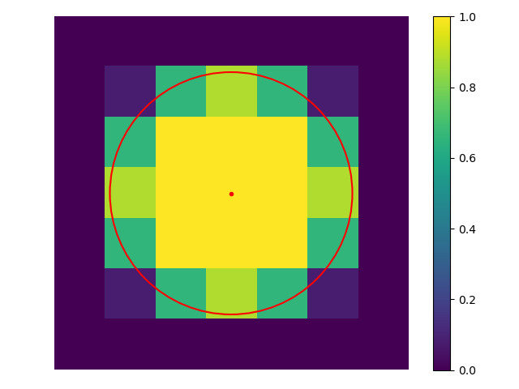

# 'fluoscenepy' project
This project helps to simulate the microscopic images with the basic structures: beads and ellipses, calculated using various concepts. 
If it sounds too ambitious, please, consider it only as the good intention to have such useful tool ready for various evaluations 
(e.g. for evaluation of image processing workflows),  but not as the solid and proven approach, that has been published somewhere.

### Ratio for project development
Even though, there exist number of similar and much more advanced projects, which addresses the task of fluorescence microscopic image
simulations, and, moreover, the task of bead simulation seems to be trivial, nevertheless, I haven't seen the appropriate library
for the simulation of the precise bead (circle) projection on the pixels grid. The circle ('ball') with 1 pixel radius, not shifted
from the center of pixel (exact coordinates like (1, 1) for the circle center) can be projected on the pixel grid 
in the following ways:

1) "Normal" Circle. The 4 pixels (on 90 degree directions) on the borders are included because 
the distance between them and the center of the circle is precisely 1 pixel and equal to the radius.   
   
    

```python
# Python code snippet
from fluoscenepy import FluorObj
flobj = FluorObj(typical_size=2.0, border_type="computed", shape_method="circle")
flobj.get_shape(); flobj.plot_shape()
```
   
2) "Oversampled" Circle. All pixels within the circle border are included into the projection with the maximum 
(though normalized) intensity.

     

The code snippet is the same as for the "normal" circle above, only the parameter should be set as: 
***shape_method="oversampled circle"***.

3) "Undersampled" Circle. Only pixels, that lay completely within the border, are included into the projection.

  

The code snippet is the same as for the "normal" circle above, only the parameter should be set as: 
***shape_method="undersampled circle"***.   

Intuitively, the problem can be solved either by calculation the area of intersection of each pixel with the circle
border, or by using some bell-shaped analytic function for the shape description 
([more information](https://en.wikipedia.org/wiki/Bell-shaped_function) on these functions).   
To illustrate this, the following shapes could be plotted: 
1) The shape with calculated areas of the intersection of each pixel with the circular border ("Precise" Circle):      

   

The normalized intensity values in the pixels, which intersect with the circular border, is calculated from the ratio
of occupied area laying within the circular border, as on the following picture (the left center pixel):     

   

2) To illustrate better the effect of area intersections calculation, the shape of the bead with diameter of 
4.8 pixels:      


```python
from fluoscenepy import FluorObj
flobj = FluorObj(typical_size=4.8); flobj.get_shape(); flobj.plot_shape()
```

3) The "continuously" shaped bead can be calculated using implemented in the ***FluorObj*** bell-shaped 
functions, e.g. gaussian, lorentzian, and so on (full list can be printed out by calling the
***get_shaping_functions()*** method). Note that the calculation can be performed only for the parameter 
set as: ***border_type='computed'*** or ***border_type='co'***. For the illustration of the calculated
shape:    


```python
from fluoscenepy import FluorObj
flobj = FluorObj(typical_size=4.8, border_type="co", shape_method="bump3")
flobj.get_shape(); flobj.plot_shape()
```

The problem of precise shape projection of the circle on the pixel grid becomes even more significant 
if its center is shifted from the origin of the pixel. To illustrate this, below are a few examples of the shifted by (0.24, 0.0)
circles.   
Shifted "Normal" Circle:    

.png "Shifted Normal Circle 1px R")

Shifted "Precise" Circle:   

.png "Shifted Precise Circle 1px R") 

### Generation of a microscopic image ("fluorescence scene")
It can be achieved by placing circular of elliptical particles on the "scene". Check the API documentation for all 
available methods for making it. 
One of the straightforward way is just to use methods for generation of objects with random shapes, sizes, maximum intensities, and 
placed randomly on the scene. The code example: 
```python
from fluoscenepy import FluorObj, UscopeScene
samples = UscopeScene.get_random_objects(mean_size=(9.11, 6.56), size_std=(1.15, 0.82), 
                                         shapes='mixed', intensity_range=(185, 252), 
                                         n_objects=12, verbose_info=True)
scene = UscopeScene(width=62, height=54)
samples_pl = scene.set_random_places(samples, overlapping=False, touching=False, 
                                     only_within_scene=True, verbose_info=True)
# Placing objects randomly on the scene, without noise
scene.put_objects_on(samples_pl, save_only_objects_inside=True)
scene.add_noise()  # adding standard noise
```
For comparison, generated scene without standard for CMOS cameras additional noise:     


Generated scene with additional noise calculated with default method parameters:    


### Performance of calculations
Note that even single 'precise' shaped round object (bead) generation can take around 2 seconds for the diameter 12 pixels
because of the slow nested for loops for calculating each pixel which is partially within the circle border.   
To speed up the calculations, one can install the [numba](https://numba.pydata.org/) library in same Python environment
and provide the according flags in calculation methods, similar to following code snippets: 
````python
import numpy as np
from fluoscenepy import FluorObj, force_precompilation
force_precompilation()   # force precompilation of computational functions by numba
# Round shape object generation
r_obj_acc = FluorObj(typical_size=12.0)
r_obj_acc.get_shape(accelerated=True)  # takes ~ 0.7 - 1 sec 
r_obj = FluorObj(typical_size=12.0)
r_obj.get_shape()  # takes ~ 2.3 - 2.7 sec 
# Ellipse shape object generation
el_obj_acc = FluorObj(shape_type='ellipse', typical_size=(7.5, 6.0, np.pi/3))
el_obj_acc.get_shape(accelerated=True)  # takes ~ 1.1 - 1.8 sec 
el_obj = FluorObj(shape_type='ellipse', typical_size=(7.5, 6.0, np.pi/3))
el_obj.get_shape()  # takes ~ 3.6 - 5.7 sec 
````
